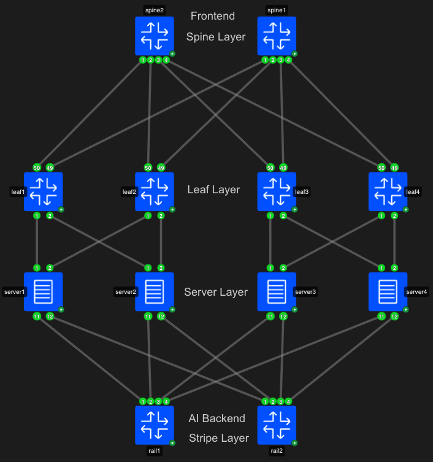
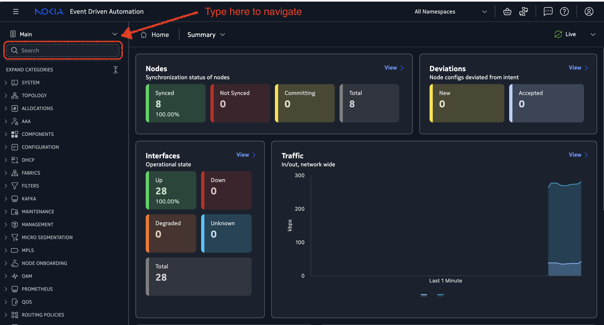
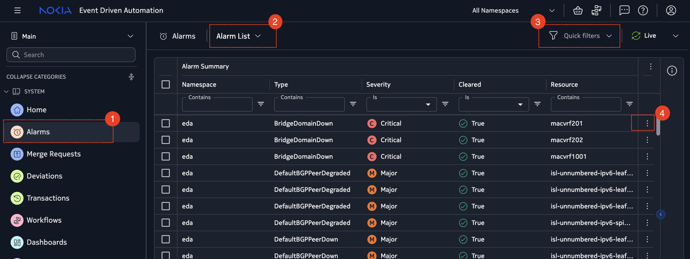
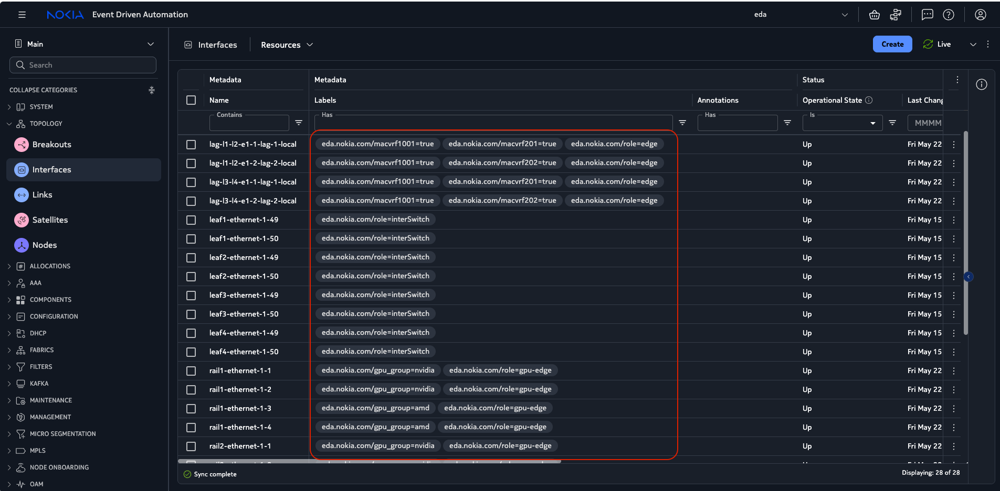
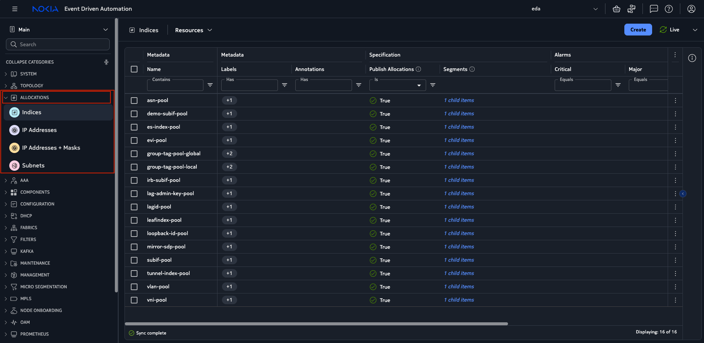
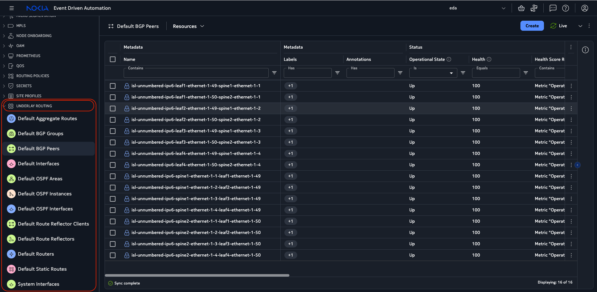
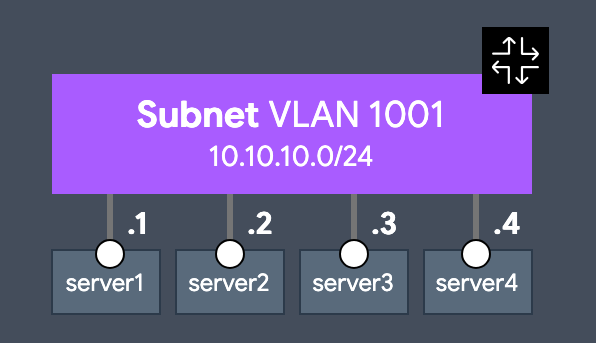
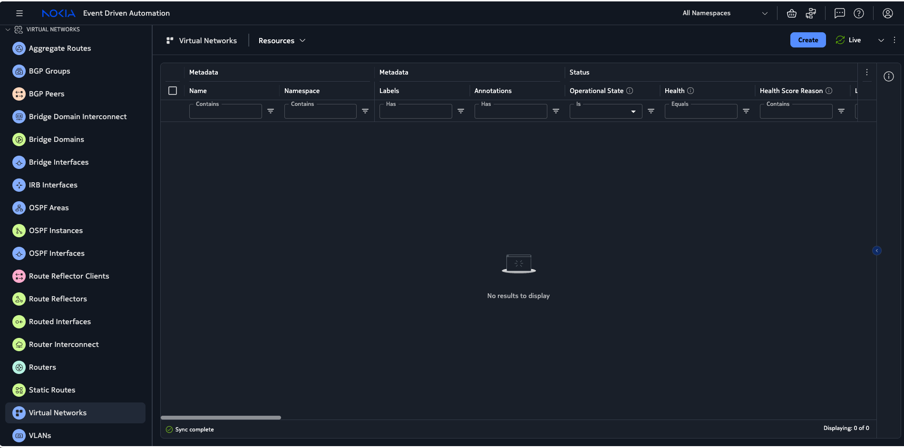
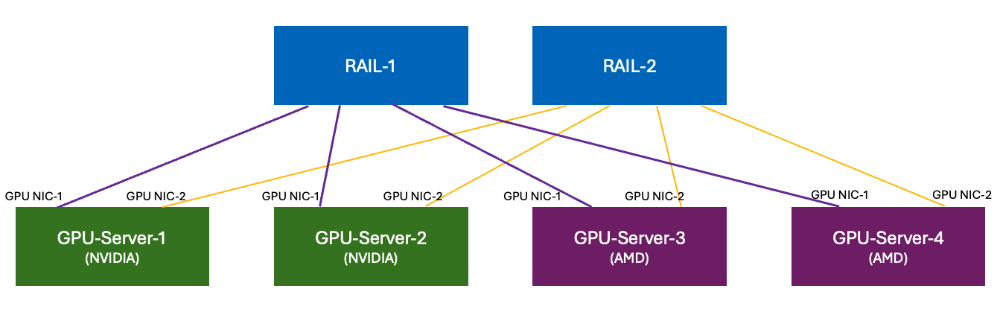
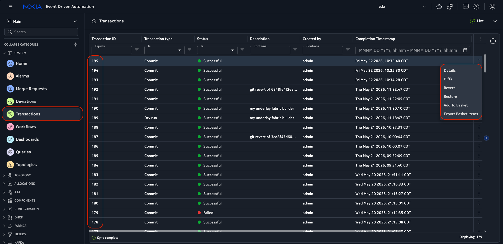

# AI Backend Fabric Workshop with Nokia EDA and SR Linux

**Authors**

- [Mohammad Zaman, Nokia](www.linkedin.com/in/mohammad-f-zaman) — GitHub: [mfzhsn](https://github.com/mfzhsn)
- [Amer Fakhar, Nokia](https://www.linkedin.com/in/amerf-linkedin/) — GitHub: [skyglid3r](https://github.com/skyglid3r)

## Table of Contents


* [Topology](#topology)
* [Access Details](#access-details)
* [IP Mapping](#ip-mapping)
* [Activities](#activities)
* [Activity 1: Concepts of Intent-Based Networking and Getting Familiar with EDA - Building Datacenter Fabric](#activity-1-concepts-of-intent-based-networking-and-getting-familiar-with-eda---building-datacenter-fabric)
* [Activity 2: Building Overlay VRF - Layer 2 MAC-VRF](#activity-2-building-overlay-vrf---layer-2-mac-vrf)
* [Activity 3: Building AI Backend Fabric - RoCEv2 Rail-Optimized AI Backend Fabric](#activity-3-building-ai-backend-fabric---rocev2-rail-optimized-ai-backend-fabric)
* [Activity 4: Intent Based Rollback and Revert](#activity-4-intent-based-rollback-and-revert)
* [Activity 5: Perform RDMA Traffic between Server1 and Server2 using Soft-RoCE](#activity-5-perform-rdma-traffic-between-server1-and-server2-using-soft-roce)
* [References and Resources](#happy-learning-and-exploring-nokia-eda-and-sr-linux)


## Topology



The workshop topology represents a simplified AI/HPC data center fabric with a front-end leaf/spine network, simulated server/GPU nodes, and a dedicated backend rail network. The front-end network provides general network access and fabric reachability. The backend network provides the high-performance routed connectivity used by the simulated AI workload endpoints.

The backend rail switches are labeled as `RAIL 1` and `RAIL 2`. These backend leaf switches are used to build the AI backend fabric using Nokia EDA intent.

## Access Details

| Component | How to Access | Example |
|---|---|---|
| Nokia EDA | Browser | `https://<Number>.workxshop.net:9443` |
| Grafana | Browser | `https://<Number>.workxshop.net:9443/core/httpproxy/v1/grafana/d/Telemetry_Playground/` |
| Leaf1/2/3/4/ RAIL1/2 | CLI | Run command `connect`, Select the number |
| Server 1/2/3/4 | Container shell | Run command `connect`, Select the number |

### IP Mapping

| Server       | Linux VRF | Frontend Bond | MAC-VRF / VLAN 1001 IP      | IP-VRF VLAN | IP-VRF IP      | GPU1 / Rail1 IF | GPU1 IPv6              | GPU2 / Rail2 IF | GPU2 IPv6              |
| ------------ | --------- | ------------- | --------------------------- | ----------- | -------------- | --------------- | ---------------------- | --------------- | ---------------------- |
| server1 / s1 | `vrf-s1`  | `b1`          | `b1.1001` = `10.10.10.1/24` | `b1.201`    | `10.20.1.1/24` | `s1eth11`       | `fd00:100:101:1::2/64` | `s1eth12`       | `fd00:100:201:1::2/64` |
| server2 / s2 | `vrf-s2`  | `b2`          | `b2.1001` = `10.10.10.2/24` | `b2.202`    | `10.20.2.2/24` | `s2eth11`       | `fd00:100:101:2::2/64` | `s2eth12`       | `fd00:100:201:2::2/64` |
| server3 / s3 | `vrf-s3`  | `b3`          | `b3.1001` = `10.10.10.3/24` | `b3.201`    | `10.20.1.3/24` | `s3eth11`       | `fd00:100:101:3::3/64` | `s3eth12`       | `fd00:100:201:3::3/64` |
| server4 / s4 | `vrf-s4`  | `b4`          | `b4.1001` = `10.10.10.4/24` | `b4.202`    | `10.20.2.4/24` | `s4eth11`       | `fd00:100:101:4::4/64` | `s4eth12`       | `fd00:100:201:4::4/64` |

---

# Activities

## Activity 1: Concepts of Intent-Based Networking and Getting Familiar with EDA - Building Datacenter Fabric

In this activity, participants will learn the operational model of intent-based networking and become familiar with the Nokia EDA user interface.

Intent-based networking means the operator describes the desired outcome instead of manually configuring every device line-by-line. The intent describes what the network should become. EDA uses that intent to generate configuration, push configuration to the correct nodes, validate the resulting state, and continuously reconcile the infrastructure when the operational state changes.

In this lab, the desired outcome is an AI backend fabric with routed IPv6 links, IP-VRF based isolation, backend rail switches, GPU/server-facing interfaces, and validation of RDMA traffic between simulated servers.

### Step 1: Login to Lab resources.

#### 1.1 Login to EDA (Event Driven Automation UI)

Open a browser and navigate to:

```text
https://<Lab_ID_Number>.workxshop.net:9443
```
Login using the credentials provided by the instructor.

#### 1.2 Open Grafana Dashboard

Open a browser and navigate to:

```
https://<Lab_id_Number>.workxshop.net:9443/core/httpproxy/v1/grafana/d/Telemetry_Playground/
```

#### 1.3 Open Lab Instance SSH 

Use Putty/SecureCRT to create ssh connection

```
ssh nokiauser@<Lab_ID_Number>.workxshop.net
```
Password: provided by instructor in the post card


### Step 2: Review the EDA layout

After login, review the main EDA navigation areas.

Start with these views:

| EDA View                       | Purpose                                                                                        |
| ------------------------------ | ---------------------------------------------------------------------------------------------- |
| **Topology**                   | Visualize the fabric, nodes, links, server attachments, and backend rail connectivity          |
| **Nodes**                      | Inspect discovered nodes, management reachability, software state, and operational status      |
| **Alarms**                     | Review current issues, failed deployments, node reachability problems, and validation failures |
| **Deployments / Transactions** | Review configuration pushes, generated intent, success or failure state, and rollback history  |
| **Dashboards / Observability** | Review telemetry and health information for the AI backend fabric                              |


### Step 3: Inspect the Datacenter Inventory



1. Check the **Topology** View in EDA by typing `Topologies` in the search bar. Double click on `Physical`.

2. Check the **Nodes** Inventory in EDA by typing `Nodes`.

3. Check **Interfaces** Inventory in EDA by typing `Interfaces`.

4. Check **Alarms** sectionby typing `Alarms`.



Nokia EDA provides an **Alarms** view to monitor active and historical issues across managed resources, such as fabrics, nodes, interfaces, services, and applications.  Alarms can be filtered, acknowledged, temporarily suppressed, reviewed in detail, and managed through both the EDA UI and `edactl`.  

Each alarm includes useful operational context such as severity, resource, namespace, source kind, occurrence count, and last change time.  Alarm policies can also be configured to automatically suppress, acknowledge, or change severity for matching alarms. 


The **Remediation** section is especially important because it helps operators understand **why the alarm happened and what action to take next**.  
It includes fields such as **Parent Alarms**, **Probable Cause**, and **Remedial Action**, helping users move from alarm visibility to guided troubleshooting and faster recovery. 

- **Probable Cause**: Describes the most likely reason the alarm was triggered, helping operators quickly understand the root issue.

- **Remedial Action**: Provides the recommended next steps or corrective actions to resolve the alarm condition.


### Step 4: Concepts of Labels, Selectors and Allocations in EDA

**labels** are key-value pairs attached to nodes, interfaces, and other resources to provide metadata and context. They are user-defined and can represent any attribute relevant to the resource, such as role, location, hardware type, or custom tags.




**Selectors** are used in intents to match resources based on their labels, allowing EDA to automatically discover and include the correct nodes, interfaces, or links when building fabrics and services.

**Allocations** are used to define a range of values for certain parameters, such as IP addresses or ASNs. EDA can automatically allocate values from these pools when building the fabric, simplifying management and ensuring consistency.





### Step 5: Build Datacenter Fabric using EDA Intent

In the search bar type `Fabric`. Click on `Fabric`. On the top right, click on `Create`.

Input the parameters provided below to create the Intent. 

This step creates the EDA **Fabric** resource that builds the underlay network between the leaf and spine switches.  

The fabric uses **eBGP** as the underlay routing protocol and uses **IPv6 unnumbered** on inter-switch links.  
EDA automatically selects the leaf, spine, and inter-switch links based on node labels, then allocates system IPv4 addresses and BGP ASNs from the configured pools.

Create Fabric Underlay intent with the following parameters:

| Field                       | Value                               |
| --------------------------- | ----------------------------------- |
| Fabric Name                 | `myfabric`                          |
| Namespace                   | `eda`                               |
| System IPv4 Pool            | `systemipv4-pool`                   |
| Leaf Node Selector          | `eda.nokia.com/role=leaf`           |
| Spine Node Selector         | `eda.nokia.com/role=spine`          |
| Inter-Switch Link Selector  | `eda.nokia.com/role=interSwitch`    |
| Inter-Switch Addressing     | `IPv6 Unnumbered`                   |
| Inter-Switch Link MTU       | `9200`                              |
| Underlay Protocol           | `EBGP`                              |
| Underlay ASN Pool           | `asn-pool`                          |
| Overlay Protocol            | `EBGP`                              |


Before commiting, click on the `Dry Run` or `Add to Basket` button to validate the intent and preview the generated configuration changes and then you can `Commit` the intent to apply the configuration to the network devices.


### Verification

#### Using EDA UI



#### Using CLI

1. Open Terminal and enter `connect` utility

2. Connect to any leaf nodes and check the BGP peer status

```
--{ + running }--[  ]--
A:admin@leaf1# show network-instance default protocols bgp neighbor
-----------------------------------------------------------------------------------------------------------------------------------
BGP neighbor summary for network-instance "default"
Flags: S static, D dynamic, L discovered by LLDP, B BFD enabled, - disabled, * slow
-----------------------------------------------------------------------------------------------------------------------------------
-----------------------------------------------------------------------------------------------------------------------------------
+---------------+---------------------+---------------+-----+--------+------------+------------+-----------+---------------------+
|   Net-Inst    |        Peer         |     Group     | Fla | Peer-  |   State    |   Uptime   | AFI/SAFI  |   [Rx/Active/Tx]    |
|               |                     |               | gs  |   AS   |            |            |           |                     |
+===============+=====================+===============+=====+========+============+============+===========+=====================+
| default       | fe80::45:2cff:feff: | bgpgroup-     | D   | 101    | establishe | 3d:12h:53m | evpn      | [60/53/20]          |
|               | 1%ethernet-1/50.0   | ebgp-myfabric |     |        | d          | :28s       | ipv4-     | [4/4/2]             |
|               |                     |               |     |        |            |            | unicast   | [0/0/0]             |
|               |                     |               |     |        |            |            | ipv6-     |                     |
|               |                     |               |     |        |            |            | unicast   |                     |
| default       | fe80::4d:c5ff:feff: | bgpgroup-     | D   | 101    | establishe | 3d:12h:53m | evpn      | [60/0/80]           |
|               | 1%ethernet-1/49.0   | ebgp-myfabric |     |        | d          | :29s       | ipv4-     | [4/4/5]             |
|               |                     |               |     |        |            |            | unicast   | [0/0/0]             |
|               |                     |               |     |        |            |            | ipv6-     |                     |
|               |                     |               |     |        |            |            | unicast   |                     |
+---------------+---------------------+---------------+-----+--------+------------+------------+-----------+---------------------+
-----------------------------------------------------------------------------------------------------------------------------------
Summary:
0 configured neighbors, 0 configured sessions are established, 0 disabled peers
2 dynamic peers
```

---


## Activity 2: Building Overlay VRF - Layer 2 MAC-VRF

Once the underlay Fabric is built and stable, the next step is to build the overlay VRF networks used by the IT applications.

### MAC VRF Topology



A MAC-VRF provides Layer-2 connectivity for endpoints within the same subnet/VLAN. In this example, users configure VLAN 1001 with subnet 10.10.10.0/24, allowing server1–server4 to communicate as if they are on the same Layer-2 segment.


### Step 1: Create an Intent for the MAC-VRF 

Navigate to **Virtual Networks > Virtual Networks** section in EDA in the left navigation pane and click on `Create` button on the top right corner.



### Step 2: Create MACVRF Intent

Create MAC-VRF intent with the following parameters:

| Field                | Value                      |
| -------------------- | -------------------------- |
| Virtual Network Name | `macvrf1001`               |
| Namespace            | `eda`                      |
| Specification:        |                            |

**Under the Bridge Domain section > Click on `+ Add` and input the following parameters:**

| Bridge Domain        | Value                      |
| -------------------- | -------------------------- |
| Bridge Domain Name   | `macvrf1001`               |
| Service Type         | `EVPNVXLAN`                |
| EVI Allocation Pool             | `evi-pool`                          |
| Bridge Domain Spec,  Encapsulation Options  | enable                     |
| Bridge Domain Spec , Encapsulation Options,  VXLAN Options | enable     |
| VNI Allocation Pool | `vni-pool`     |
| Tunnel Index Allocation Pool | `tunnel-index-pool`     |
| Bridge Domain Spec, MAC Learning| enable     |
| MAC Aging Time       | `300` seconds              |

**Click Add (bottom right) to save the Bridge Domain configuration**

| VLAN        | Value                      |
| -------------------- | -------------------------- |
| VLAN NAME              | macvrf1001                     |
| Bridge Domain.         | macvrf1001                     |
| Interface Selector  | `eda.nokia.com/macvrf1001` |
| VLAN ID         | `1001`                     |


EDA uses the configured interface selector to discover all interfaces labeled eda.nokia.com/macvrf1001. Any matching server-facing interfaces are automatically bound to the MAC-VRF bridge domain for VLAN 1001.

### Step 3: Verification

Open `sping` from the terminal and generate ping across servers to confirm connectivity.

Example: `sping s1 s4 interval 0.01 size 8000 count 10000`, Open Grafana Dashboard and you can observe the traffic passing across links

**Config Verification**

Step-1: Open Terminal and enter `connect` utility

```
[root@zabbix-dot-22 common]# connect
=====================================
 Available Targets to Log In
=====================================
--- Network Nodes ---
[ 1] leaf1
[ 2] leaf2
[ 3] leaf3
[ 4] leaf4
[ 5] rail1
[ 6] rail2
[ 7] spine1
[ 8] spine2
--- Docker Servers ---
[ 9] server1
[10] server2
[11] server3
[12] server4
=====================================
```
Step-2: Connect to any leaf nodes and check the configuration

**configurations**

```
--{ + running }--[  ]--
A:admin@leaf1# info network-instance macvrf1001
    type mac-vrf
    admin-state enable
    description macvrf1001
    interface lag1.1001 {
    }
    interface lag2.1001 {
    }
    vxlan-interface vxlan0.500 {
    }
    protocols {
        bgp-evpn {
            bgp-instance 1 {
                vxlan-interface vxlan0.500
                evi 100
                ecmp 8
                routes {
                    bridge-table {
                        mac-ip {
                            advertise true
                            advertise-arp-nd-only-with-mac-table-entry true
                        }
                        inclusive-mcast {
                            advertise true
                        }
                    }
                }
            }
        }
        bgp-vpn {
            bgp-instance 1 {
                route-target {
                    export-rt target:1:100
                    import-rt target:1:100
                }
            }
        }
    }
    bridge-table {
        mac-learning {
            admin-state enable
            aging {
                admin-state enable
                age-time 300
            }
        }
    }
```

## Activity 3: Building AI Backend Fabric - RoCEv2 Rail-Optimized AI Backend Fabric

In this activity, users will create an **AI Backend Fabric** intent using the EDA UI form.  
This intent builds the backend rail network used for GPU-to-GPU communication and RoCEv2 transport across the AI fabric.



### Step 1: Create AI Backend Fabric Intent

#### Activity: Create an AI Backend Fabric Intent in EDA UI

EDA uses the configured node and interface selectors to automatically discover the correct rail switches and GPU-facing interfaces.  
Interfaces labeled for the `nvidia` or `amd` GPU isolation groups are automatically associated with their respective backend fabric groups.
In the search bar type `ai`. Click on `AI Backends` on bottom left. On the top right, click on `Create`.

---

#### Intent Summary

| Field | Value |
|---|---|
| Name | `aibackend` |
| Namespace | `eda` |
| Specification: |  |
| System IPv4 Pool | `ip-pool` |
| ASN Pool | `asn-pool` |
| IP MTU | `4200` |

**Enter Stripe Configuration by clicking on `Add+`**

| Stripe | Value |
|---|---|
| Stripe Name | `stripe1` |
| Stripe ID | `1` |
| System IPv4 Pool | `systemipv4-pool` |
| ASN Pool | `asn-pool` |
| Node Selector | `eda.nokia.com/role = rail` |

*Click  on ADD and return to the main form to enter the GPU isolation group configuration.*


**Enter GPU Isolation Configuration by clicking on `Add+`**


| GPU Isolation Group | Interface Selector |
|---|---|
| Isolation Group  | `nvidia` |
| Interface Selector | `eda.nokia.com/gpu_group = nvidia` |

**Food for Thought:** Add another isolation group for `amd` GPUs with selector `eda.nokia.com/gpu_group = ???`. 

**Hint:** If you are unaware of the labels for AMD GPU interfaces, check the interface inventory or topology view in EDA to find the correct label key and value.

*Click  on ADD and return to the main form*


| Field | Value |
|---|---|
| Address Allocation | enable |
| Type | EDAManagedIPv6  |
|EDA Managed Allocation Properties | enable |
| Prefix Length | 64 |
| Leaf Index Pool Scope | Global |
---

#### Stripe Configuration

Click on `Add+ for Stripes`.
A **stripe** represents a backend rail group in the AI fabric.  
In this example, EDA discovers all nodes labeled with the rail role and includes them in `stripe1`.

| Field | Value |
|---|---|
| Stripe Name | `stripe1` |
| Stripe ID | `1` |
| System IPv4 Pool | `ip-pool` |
| ASN Pool | `asn-pool` |
| Node Selector | `eda.nokia.com/role = rail` |


---

After filling out the Intent form, Either `Add to Basket`, or `Commit` the form, EDA creates the `Backend` intent and automatically builds the AI backend fabric using the selected rail nodes and GPU-facing interfaces.

The fabric is configured with IPv6 addressing, ASN allocation, RoCEv2 QoS parameters, and GPU isolation groups for `nvidia` and `amd` workloads.


### Step 3: Verification

Using `sping`, generate ping across GPU Servers to confirm connectivity.

Example: `sping gpu1 s1 s2`

**Food for Thought:** 

1. Generate traffic from S1 towards S2, Guess the outcome ?
2. Generate traffic from S1 towards S3/s4, Guess the outcome ?


## Activity 4: Intent Based Rollback and Revert 

Nokia EDA uses **network-wide transactions** to safely apply intent-based changes across multiple devices. When an operator creates or updates an EDA resource, EDA calculates the required device-level changes and applies them as a single transaction.

The key benefit is **atomic change control**: either all affected devices are updated successfully, or the transaction fails and partial configuration is avoided. This helps reduce operational risk when deploying multi-device services such as fabrics, MAC-VRFs, IP-VRFs, ACLs, and backend network intents. 

#### Why Transactions Matter

| Capability | Description |
| ---------- | ----------- |
| Transaction Basket | Stages one or more intended changes before applying them |
| Dry Run | Validates the proposed change before committing it |
| Diff View | Shows the exact before/after configuration changes |
| Commit | Applies the transaction to the affected network devices |
| Transaction List | Provides audit history of committed, failed, and dry-run transactions |
| Revert | Rolls back the input resources from a specific transaction |
| Restore | Brings the full EDA system state back to a selected transaction point |

#### Dry Run

Before committing a change, users can run a **Dry Run** to preview what EDA will apply to the network.  
Dry Run performs validation and shows diffs so operators can review the expected changes before touching the actual devices. 

#### Diff

The **Diff** view shows the configuration changes that EDA intends to push to the nodes.  
This helps users verify the generated device configuration before committing the transaction.

#### Commit

After validation, users can commit the transaction.  
EDA then applies the calculated changes across all affected nodes using its network-wide transaction mechanism.

#### Revert

**Revert** is used when you want to undo a specific committed transaction.  
It sets the input resources from that transaction back to their previous state, while creating a new transaction record.

#### Restore

**Restore** is broader than Revert.  
It returns EDA resources, applications, and allocations to the exact state recorded at a selected transaction point.

#### Revert vs Restore

| Action | Use Case |
| ------ | -------- |
| Revert | Undo one specific transaction |
| Restore | Return the entire EDA platform state to a previous committed point |

Both **Revert** and **Restore** are executed as new transactions, so the history always moves forward and remains auditable. 





### 4.1 Perform a Revert Action for the last applied AI Fabric Intent

1. Navigate to Deployments > Transactions in EDA UI
2. Select the last committed transaction for the AI Fabric intent
3. Click the Revert button to undo the changes from that transaction
4. Review the new transaction created for the Revert action and verify the device configuration is rolledback to the previous state

### 4.2 Perform a Restore Action for the last applied AI Fabric Intent


**Food for Thought:** 

Now from the previous step, we have reverted the AI Fabric intent. Now we will perform a restore action to bring back the EDA system to the state before the revert on Single Click ? Possible ?


## Activity 5: Perform RDMA Traffic between Server1 and Server2 using Soft-RoCE

This section shows how to run a simple IPv6 Soft-RoCE bandwidth test using `ib_send_bw`, We will use the `rxe` (Soft-RoCE) driver to simulate RDMA traffic between server1 and server2 over the backend fabric. Soft-RoCEv2 provides a software-based RoCEv2/RDMA interface on top of regular Ethernet interfaces, allowing RDMA tools and workflows to be tested without physical RDMA NICs.

*Disclaimer: This activity is meant for demo and show how RoCEv2/IB_Test tools, For the purpose of this workshop, we tried to simulate the soft-roce in a single VM. This is not a typical setup for production or performance testing or labs, but it allows us to demonstrate the concepts and tools in a contained environment.*


The test uses two RXE devices:

| Role | Node | RXE Device | Purpose |
|---|---|---|---|
| Server | server1 | `rxe2` | Listens for the RDMA connection |
| Client | server2 | `rxe1` | Connects to the server |
| Target IP | server1 | `fd00:60::11` | Server-side IPv6 address |

### Bandwidth Test

**Server Side - Server1**

Open the first terminal and connect to `server1` using the `connect` utility:

```
ib_send_bw -d rxe2 -F --ipv6 --ipv6-addr -x 2 -R --report_gbits
```

The sercer will start and wait for the client to connect, showing the message below:

```
************************************
* Waiting for client to connect... *
************************************
```

**Client Side - Server2**

Initialize the Bandwidth Test Client on `server2`

Open a second terminal and connect to `server2` using the `connect` utility:

```
ib_send_bw -d rxe1 -F --ipv6 --ipv6-addr -x 2 -R --report_gbits fd00:60::11
```

Sample Output:

```
WARNING: BW peak won't be measured in this run.

************************************
* Waiting for client to connect... *
************************************
---------------------------------------------------------------------------------------
                    Send BW Test
Dual-port       : OFF          Device         : rxe2
Number of qps   : 1            Transport type : IB
Connection type : RC           Using SRQ      : OFF
PCIe relax order: ON
ibv_wr* API     : OFF
RX depth        : 512
CQ Moderation   : 1
Mtu             : 1024[B]
Link type       : Ethernet
GID index       : 2
Max inline data : 0[B]
rdma_cm QPs     : ON
Data ex. method : rdma_cm
---------------------------------------------------------------------------------------
Waiting for client rdma_cm QP to connect
Please run the same command with the IB/RoCE interface IP
---------------------------------------------------------------------------------------
local address: LID 0000 QPN 0x0015 PSN 0xae3810
GID: 253:00:00:96:00:00:00:00:00:00:00:00:00:00:00:17
remote address: LID 0000 QPN 0x0014 PSN 0xae3810
GID: 253:00:00:96:00:00:00:00:00:00:00:00:00:00:00:17
---------------------------------------------------------------------------------------
#bytes     #iterations    BW peak[Gb/sec]    BW average[Gb/sec]   MsgRate[Mpps]
65536      1000             0.00               6.19               0.011814
---------------------------------------------------------------------------------------
```

### Latency Test

**Server Side - Server1**

Start the bandwidth test listener on `server1`:

```
ib_send_lat -d rxe2 -F --ipv6 --ipv6-addr -x 2 -R --report_gbits
```

**Client Side - Server2**

Start the bandwidth test client on `server2`:

```
ib_send_lat -d rxe1 -F --ipv6 --ipv6-addr -x 2 -R --report_gbits fd00:60::11
```

**Food for Thought:** 

Try to understand the output of the bandwidth and latency tests. What do the different columns represent ? Check the Transport type, the QP type, the message size, and the achieved bandwidth/latency numbers. 


## Happy Learning and Exploring Nokia EDA and SR Linux!

Reach us directly on the [Nokia EDA Community Discord](https://discord.com/channels/1275801420184158331/1275801420184158334) if you have any questions or want to share your experience:

- [Nokia EDA Documentation](https://docs.eda.dev/)
- [Nokia EDA Product Page](https://www.nokia.com/data-center-networks/data-center-fabric/event-driven-automation/)
- [Nokia SR Linux Learn Site](https://learn.srlinux.dev/)
- [ Nokia Validated Designs](https://www.nokia.com/data-center-networks/validated-designs/)


## Soluions to Activities

**Activity 1: Datacenter Fabric**

```
apiVersion: fabrics.eda.nokia.com/v1
kind: Fabric
metadata:
  name: myfabric
  namespace: eda
spec:
  interSwitchLinks:
    ipMTU: 9200
    linkSelectors:
      - eda.nokia.com/role=interSwitch
    unnumbered: IPv6
  leafs:
    leafNodeSelectors:
      - eda.nokia.com/role=leaf
  overlayProtocol:
    bgp: {}
    protocol: EBGP
  spines:
    spineNodeSelectors:
      - eda.nokia.com/role=spine
  systemPoolIPv4: systemipv4-pool
  underlayProtocol:
    bgp:
      asnPool: asn-pool
    protocols:
      - EBGP
```

**Activity 2: Overlay Virtual Network L2 MAC VRF**

```
apiVersion: services.eda.nokia.com/v2
kind: VirtualNetwork
metadata:
  name: macvrf1001
  namespace: eda
spec:
  bridgeDomains:
    - name: macvrf1001
      spec:
        encapOptions:
          vxlan:
            tunnelIndexPool: tunnel-index-pool
            vniPool: vni-pool
        eviPool: evi-pool
        macLearning:
          agingTimeSeconds: 300
          enabled: true
        type: EVPNVXLAN
  bridgeInterfaces: []
  irbInterfaces: []
  routedInterfaces: []
  routers: []
  vlans:
    - name: macvrf1001
      spec:
        bridgeDomain: macvrf1001
        interfaceSelectors:
          - eda.nokia.com/macvrf1001
        vlanID: '1001'
```

**Activity 3: AI Backend Datacenter Fabric**

```
apiVersion: aifabrics.eda.nokia.com/v1
kind: Backend
metadata:
  name: ai-backend-fabric
  namespace: eda
spec:
  addressAllocation:
    edaManagedIPv6:
      leafIndexPoolScope: Global
      prefixLength: '64'
    type: EDAManagedIPv6
  asnPool: asn-pool
  gpuIsolationGroups:
    - interfaceSelectors:
        - eda.nokia.com/gpu_group = nvidia
      name: nvidia
    - interfaceSelectors:
        - eda.nokia.com/gpu_group = amd
      name: amd
  ipMTU: 4200
  rocev2QoS:
    ecnMaxDropProbabilityPercent: 100
    ecnSlopeMaxThresholdPercent: 80
    ecnSlopeMinThresholdPercent: 5
    pfcDeadlockDetectionTimerMs: 750
    pfcDeadlockRecoveryTimerMs: 750
    queueMaximumBurstSizeBytes: 1024000
  stripes:
    - asnPool: asn-pool
      name: stripe1
      nodeSelectors:
        - eda.nokia.com/role = rail
      stripeID: 1
      systemPoolIPv4: systemipv4-pool
  systemPoolIPv4: systemipv4-pool
```
